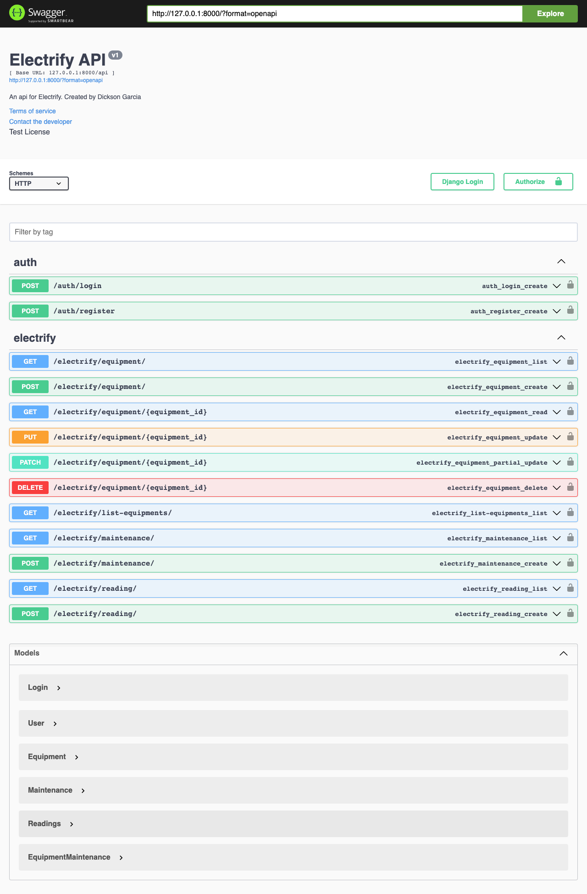

# Electrify
Electrify, an app that controls the inventory of electrical equipment and allows you to keep track of maintenance and periodic readings.

### Instalación 🔧

Para realizar la instalación se deben seguir los siguientes pasos,

_Clonación del repositorio_

```shell
git clone git@github.com:dickson7/electrify.git
```

_Ingresamos en el directorio del repositorio clonado, y ejecutamos el siguiente comando para habilitar el entorno virtual_

```shell
python3 -m venv env
```

_Activamos el entorno virtual_

```shell
source env/bin/activate
```

_Instalamos las dependencias con pip_

```shell
(env)$ pip3 install -r requirements.txt
```

_Lanzamos migraciones_

```shell
(env)$ python3 manage.py makemigrations
(env)$ python3 manage.py migrate
```


_Como último paso realizamos la ejecución del servidor_

```shell
(env)$ python3 manage.py runserver
```

### Ejecución 
Después de completar la instalación de la API y ejecutar el servidor, puedes acceder a la documentación de los endpoints visitando la dirección raíz de la API. La documentación completa de los endpoints está disponible a través de Swagger.

Es importante tener en cuenta que la API cuenta con un sistema de autorización basado en tokens generados con JWT (JSON Web Tokens). Para interactuar con los endpoints protegidos, primero debes registrarte en la API utilizando el endpoint de registro y luego realizar el inicio de sesión. Esto te proporcionará un token de acceso que deberás incluir en las solicitudes a los endpoints protegidos.

Una vez que hayas obtenido un token válido, podrás cargar los equipos, registrar mantenimientos y lecturas. Cada usuario tendrá su propio conjunto de equipos y podrá visualizar su propio inventario. Los endpoints están diseñados para proporcionar una gestión eficiente de los equipos y las actividades de mantenimiento.

Asegúrate de incluir el token de acceso en la cabecera de autorización de cada solicitud protegida, utilizando el formato 'Bearer <token>'. Esto permitirá que la API verifique tu identidad y autorice tus acciones de acuerdo con los permisos asociados a tu cuenta.

Explora la documentación detallada de la API para obtener más información sobre los diferentes endpoints disponibles, los parámetros requeridos, los tipos de respuesta y las operaciones compatibles. ¡Disfruta de la experiencia de gestión de equipos eléctricos y mantenimientos de forma segura y eficiente a través de nuestra API! 


